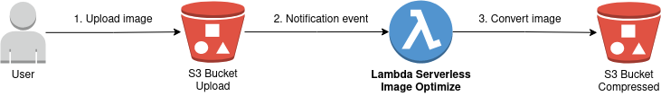

# Image Optimize



## Node.js
```
$ node -v
v10.19.0
```

## NPM
```
$ npm -v
6.13.4
```

## Serverless Framework
[Documentation](https://www.serverless.com/framework/docs/getting-started/)
```
$ serverless -v
Framework Core: 2.23.0
Plugin: 4.4.3
SDK: 2.3.2
Components: 3.7.0
```
